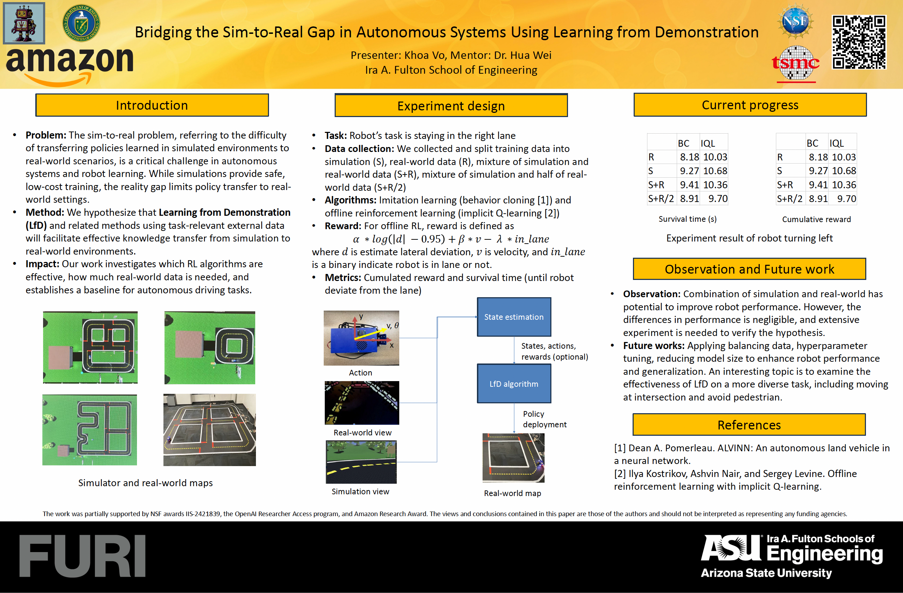

# Duckiebot Lane-following Project Setup Guide

## Project Overview

This repository contains routines to collect data, train, and test lane-follwing task for Duckiebot:

## Prerequisites

- Duckiebot running and connected to your network, make sure it is charge to more than 50%
- DTS (Duckietown Shell) installed
- ROS environment properly configured (currently use ros noetic. In case you do not have ros installed, for all code require ros (for example data visualization), run ```dts start_gui_tools robotname --mount /path/to/duckiebot_project ```
- Install robomimic ```pip install robomimic```

## Instructions (execute this at the directory where the project is)

### 1. Data collection

#### Collect bag data from duckiebot: 
```bash
# Build on the robot at dt-core directory
dts devel build -f

# Copy calibration file
scp -r duckie@robotname.local:/data/config/calibration/ /data/config/calibration/

# Run dt-core interactively
dts devel run -R robotname  --mount /path/to/dt-core --cmd /bin/bash

# Within the terminal, launch this custom lane-following:
launcher/darl.sh
# Hold A to run lane-following routine, S to stop, arrow key to navigate the robot when it stops execute routine

# Open another terminal,
docker exec -it dts-run-dt-core bash 

# launch this data collection when you want to start record data. Press ctrl+C to stop. Data will save at /data/logs/robot_name_date_time.bag at your local computer:
launcher/record_minimal_logs.sh
```

#### Visualize data: 
```bash
# Visualize a bag file
cd preprocess_data
python visualize_bag_data.py /path/to/bag_file

```

### 2. Training
```bash
# Convert data into format that robomimic prefered in hdf5 file
cd preprocess_data
python convert_hdf5_with_reward.py

# Train a model with any config having no_env, since we train offline. Currently train on asu supercomputer with 1 A100 gpu and the memory depend on the algorithms and data being used
cd robomimic
python robomimic/scripts/train.py --config exps/templates/configs_file_no_env.json --dataset ../preprocess_data/record/converted_standard
```

### 3. Testing
```bash
# Copy folder contain models and logs to the weights directory inside dt-core/packages/robomimic
# Move to dt-core and dt-core interactively. (GPU is not required; however, the model is tested with gpu) 
dts devel run -R robotname  --mount /path/to/dt-core --cmd /bin/bash -- --gpus 1
# Run the robomimic_control node
rosrun robomimic_control robomimic_control.py
```

## Troubleshooting

- If calibration copy fails, verify robot's network connection and hostname
- If the bot cannot detect the line segment properly, make sure to change the config file
- Ensure all dependencies are installed before building
- Check robot's logs if any module fails to initialize

## Notes

- Always maintain the execution order for proper system functionality
- Monitor system resources during operation

## Visuals

**Project Poster:**



**Successful Run Video:**

[Watch a successful run video](successful_run.mp4)

## Acknowledgements

We would like to express our sincere appreciation to the following for their invaluable support and opportunities that made this project possible:

* [Dr. Hua Wei and DaRL group at ASU](https://labs.engineering.asu.edu/hw/): For providing the research environment and guidance. 
* [FURI (Fulton Undergraduate Research Initiative) at ASU](https://furi.engineering.asu.edu/): For the opportunity to conduct undergraduate research.
* [The Duckietown Team](https://duckietown.com): For developing the Duckiebot platform and providing technical support resources.
* [The robomimic Team](https://robomimic.github.io): For developing and maintaining the robomimic library, a powerful tool for offline imitation learning.
